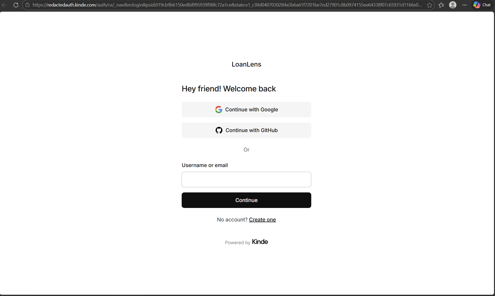

# LoanLens

LoanLens is a fintech dashboard designed to help **college students and recent graduates track, manage, and understand their student loans**.

Built during **UVM Hacks 2026 (Second Annual UVM Hackathon)**.

**2nd Place Overall**

LoanLens gives users a simple dashboard to visualize loan balances, track repayment progress, and set financial goals.

---

## Demo



Secure authentication powered by **Kinde OAuth**.

---

## Features

**Secure Authentication**
- OAuth login using Kinde
- Session-based authentication
- Secure login/logout flow

**Loan Dashboard**
- Track multiple loans
- View principal balances and minimum payments
- Visualize loan payoff progress

**Goal Tracking**
- Create financial goals
- Toggle completion status
- Track repayment progress

**Data Visualization**
- Loan payoff comparison charts
- Built with Matplotlib

---

## My Role (Holden Richard)

My primary contributions focused on **security, backend infrastructure, and presentation**.

**Authentication & Security**
- Implemented **Kinde OAuth authentication**
- Designed the secure login flow
- Integrated session middleware with FastAPI

**Backend Infrastructure**
- Built authentication routes
  - `/login`
  - `/register`
  - `/callback`
  - `/logout`
- Connected authenticated users to the application database

**Presentation**
- Led the project pitch during judging

Security was a major judging category, and the **authentication architecture was highlighted during evaluation**.

---

## Tech Stack

**Backend**
- FastAPI
- Python

**Authentication**
- Kinde OAuth

**Database**
- SQLite

**Frontend**
- Jinja2 templates
- HTML / CSS

**Visualization**
- Matplotlib

---

## Running the Project

### 1. Install dependencies

```
pip install -r requirements.txt
```

### 2. Configure environment variables

Copy the template:

```
cp .env.example .env
```

Required variables:

```
KINDE_HOST=
KINDE_CLIENT_ID=
KINDE_CLIENT_SECRET=
KINDE_REDIRECT_URI=http://localhost:8000/callback
LOGOUT_REDIRECT_URL=http://localhost:8000/
SESSION_SECRET=
```

### 3. Run the server

```
python backend.py
```

Open:

```
http://localhost:8000
```

---

## Team

- Holden Richard
- Mason Ritchie
- Tyler Sheehan
- Nicolas Fay

---

## Hackathon Context

LoanLens was built for the **fintech challenge prompt** at UVM Hacks 2026, focused on helping students improve financial literacy and make smarter financial decisions.

The project placed **2nd overall** among all teams.

---

## Future Improvements

- Automatic loan imports from financial providers
- Repayment strategy simulations
- AI-driven repayment recommendations
- Credit score impact visualization
- Mobile-friendly UI

---

## License

MIT License